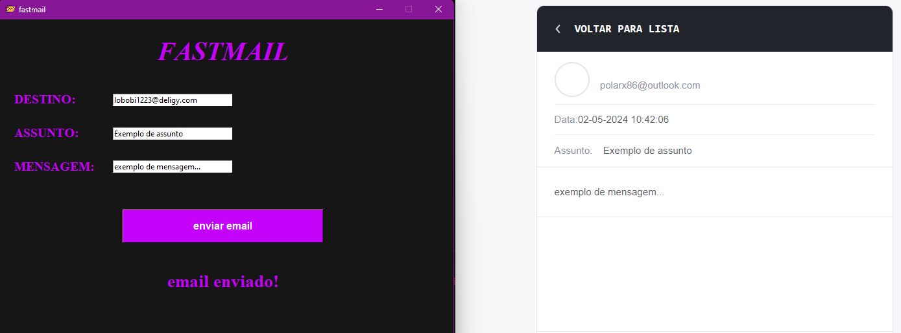

# Fastmail
 O fastmail é um simples programa que envia emails usando o outlook que ta instalado no seu computador.
 


## Funcionalidades
- Envio de e-mails utilizando a aplicação Outlook instalada no sistema.
- Interface gráfica intuitiva para preenchimento dos campos de destino, assunto e mensagem.
- Feedback visual sobre o envio do e-mail.

## Instalação
1. Certifique-se de ter o Python instalado em seu sistema. Você pode baixá-lo em [python.org](https://www.python.org/downloads/).
2. O Tkinter geralmente já vem instalado com a instalação padrão do Python em sistemas Windows, macOS e Linux, então não é necessário instalar separadamente.
3. Instale a dependência `pywin32` executando o seguinte comando no terminal:
```
pip install pywin32
```
### Clonar código fonte

Se você deseja obter o código fonte do programa em sua máquina local, você pode clonar o repositório usando o seguinte comando no terminal:
```
git clone https://github.com/polarx86/Fastmail/tree/main/fastmail
```

## Como Usar
1. Execute o programa utilizando o seguinte comando no terminal:
```
python fastmail.py
```
2. Preencha os campos de destino, assunto e mensagem.
3. Clique no botão "Enviar E-mail" para enviar a mensagem.
4. Aguarde o feedback visual indicando que o e-mail foi enviado com sucesso.
   
